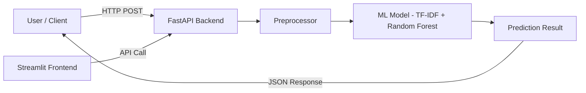

# AI Phishing Detector SaaS — Implementation Plan

## Overview

Build a full-stack SaaS application that uses Machine Learning to detect phishing emails in real-time. Users submit email text (subject + body) via a web UI or REST API, and the system returns a phishing probability score with an explanation.

---

## Architecture

## Tech Stack

| Layer | Technology | Purpose |
|-------|-----------|---------|
| **Backend** | FastAPI | REST API, async, auto-docs |
| **ML** | scikit-learn | TF-IDF vectorizer + RandomForest classifier |
| **Frontend** | Streamlit | Interactive web UI for email analysis |
| **Data** | Pandas, CSV | Dataset handling |
| **Auth** | JWT (PyJWT) | API key / token security |
| **Containerization** | Docker | Reproducible deployment |
| **Testing** | pytest, httpx | API & unit tests |

---

## User Review Required

> [!IMPORTANT]
> **Dataset**: I will create a synthetic `emails.csv` with ~200 sample emails (phishing + legitimate) for training. For production, you'd want a much larger real-world dataset (e.g., Nazario phishing corpus, SpamAssassin, etc.). Is this acceptable?

> [!IMPORTANT]
> **Frontend Choice**: The plan uses **Streamlit** for the frontend (quick to build, great for ML demos). You mentioned "Streamlit or React later" — shall I proceed with Streamlit for now?

> [!IMPORTANT]
> **Authentication**: The plan includes basic JWT-based API key auth. For a full SaaS, you'd want user registration, billing, etc. Should I keep it simple (API key only) or add user signup?

---

## Proposed Changes

### 1. Project Root Files
